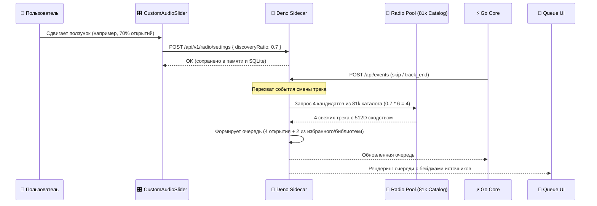

# 🏛️ Архитектура системы: Умное Нейро-Радио (musik + Sidecar + CLAP)

## 1. Топология сервисов и портов

```
┌─────────────────────────────────────────────────────────────────┐
│                           Клиенты                               │
│              (Web UI / Mobile / Автомобиль / VLC)               │
└────────────────────────────────▲────────────────────────────────┘
                                 │ HTTP :8787 (Стриминг, UI, API)
┌────────────────────────────────▼────────────────────────────────┐
│           🚀 Deno Sidecar Gateway (server.ts :8787)             │
│  - Zero-Intrusion Web Proxy & Overlay инжектор (/addon/ui.js)  │
│  - Регулятор баланса радио (discoveryRatio: 0% .. 100%)         │
│  - Двухуровневый пул рекомендаций (12D каталог -> 512D CLAP)    │
│  - Умный LRU Cache Manager (Лимит 3 ГБ, Orphan GC, Pin Protect) │
│  - Фоновый воркер импорта очереди (2000+ треков)                │
│  - Быстрая история прослушивания радио (<100мс)                 │
│  - On-Demand стриминг & yt-dlp загрузчик                        │
└───────────────▲───────────────────────────────▲─────────────────┘
                │ Прокси :8786                  │ HTTP IPC :8790
                │                               │ (CLAP расчет)
┌───────────────▼────────────────┐ ┌────────────▼─────────────────┐
│     ⚡ Go Core Player          │ │ 🧠 Python Embedder Daemon    │
│       (musik-player :8786)     │ │   (embedder.py --server :8790)
│  - Сессии, очередь, профили     │ │  - Веса CLAP прогреты в RAM │
│  - Базовые 12D рекомендации    │ │  - Инференс 1.5 - 3.0 сек    │
│  - Отдача Range-потоков        │ │  - Пакетная векторизация     │
└───────────────▲────────────────┘ └────────────▲─────────────────┘
                │ SQL                           │ SQL
                └───────────────┬───────────────┘
                                ▼
                 ┌──────────────────────────────┐
                 │    🗄️ SQLite (musik.db)      │
                 │  - tracks & features (512D)  │
                 │  - external_catalog (81k 12D)│
                 │  - listening_history         │
                 │  - pinned_tracks & favorites │
                 │  - ingestion_queue (2003 шт) │
                 └──────────────┬───────────────┘
                                │
                                ▼ Аудиофайлы
                 ┌──────────────────────────────┐
                 │       Хранилище аудио        │
                 │  dynamic/ (Кэш 3 ГБ, LRU)    │
                 │  favorites/ (Закрепленные 💾)│
                 └──────────────────────────────┘
```

---

## 2. Разделение обязанностей (Separation of Concerns)

| Компонент | Порт / Среда | Технологии | Обязанности |
| :--- | :--- | :--- | :--- |
| **Deno Sidecar** | `:8787` | Deno 2, TypeScript, SQLite | Единая точка входа. Проксирует запросы, регулирует баланс радио (`discoveryRatio`), инжектирует UI-расширения, управляет кэшем 3 ГБ, обслуживает воркер импорта и историю. |
| **Go Core** | `:8786` | Go, SQLite | Базовое ядро плеера `musik`. Ведет сессии прослушивания, историю воспроизведения, отдает сырой аудиопоток. Код **не модифицируется**. |
| **CLAP Daemon** | `:8790` | Python 3.11, PyTorch, Transformers, Librosa | Постоянно запущенный микросервис. Держит модель `larger_clap_music_and_speech` в RAM, оцифровывает треки в 512D векторы с минимальной задержкой. |
| **Web UI Overlay** | Браузер | Vanilla JS / CSS | Неинвазивный слой интерфейса. Добавляет ползунок баланса открытий, плашку источника текущего трека, бейджи в очереди, эксплорер импорта на 2000+ треков и вкладку «⏮ Прослушано». |

---

## 3. Регулирование баланса радио (Discovery Balance Engine)



* **При 0%:** Радио играет исключительно треки с отметкой «Любимое».
* **При 50%:** Радио ровно пополам чередует любимые треки и неизведанные песни из каталога 81k.
* **При 100%:** Радио превращается в чистую станцию открытий: ни одного повтора из библиотеки, только свежие треки, подходящие под ваш акустический вкус.

---

## 4. Движок отслеживания происхождения (Origin Tracking Engine)

Каждый трек в плеере снабжен цифровым паспортом происхождения:
1. `🧠 512D Вектор` — оцифрован нейросетью CLAP и имеет вектор размерности 512 в таблице `features`.
2. `⚡ 12D Каталог` — подобран по 12 числовым признакам (`energy`, `valence`, `tempo`, etc.) из таблицы `external_catalog` (81 000+ записей).
3. `❤️ Избранное` — присутствует в таблице `favorites`.
4. `💾 Закреплено` — присутствует в таблице `pinned_tracks` (не подлежит ротации).
5. `📁 <Плейлист>` — ассоциирован с пользовательским плейлистом в `playlist_tracks`.
6. `📥 Импорт` — поступил из пакетного файла через `ingestion_queue`.
7. `💿 Локальный` — физический файл хранится вне папки временного кэша `dynamic/`.

Отображение происходит в двух ключевых точках:
- **Главный экран плеера (Now Playing):** Контейнер `#addon-now-playing-origin` прямо под именем артиста.
- **Очередь будущих треков:** Цветные микро-бейджи напротив каждого элемента в списке `ol#queue`.

---

## 5. Защита диска: Избранное vs Закрепление

```
                ┌─────────────────────────────────┐
                │        Трек скачан в кэш        │
                └────────────────┬────────────────┘
                                 │
             Пользователь нажал лайк или сохранение?
                                 │
         ┌───────────────────────┴───────────────────────┐
         ▼                                               ▼
   Лайк «♥» (Избранное)                     Кнопка «💾» (Закрепить)
         │                                               │
Влияет на сессионный вкус.             Добавляется в таблицу pinned_tracks.
Может ротироваться из кэша             ИММУНИТЕТ к LRU-очистке.
при превышении лимита 3 ГБ,            Файл никогда не удаляется с диска.
если диск переполнен.
```

---

## 6. Конвейер фонового импорта (Ingestion Queue)

1. **Приём задачи:** Пользователь загружает `.txt` или `.m3u` файл (или вставляет текст).
2. **Парсинг:** Записи нормализуются к виду `{ artist, title }`. Очищаются повреждённые символы UTF-8.
3. **Пакетная вставка:** Все задачи разом сохраняются в SQLite таблицу `ingestion_queue` со статусом `pending`.
4. **Фоновый воркер (`ingestionWorker.step()`):**
   - Выбирает следующий `pending` трек.
   - Скачивает аудиопоток через `yt-dlp` с принудительной кодировкой `UTF-8`.
   - Регистрирует трек в Go Core.
   - Запрашивает 512D эмбеддинг у CLAP Daemon.
   - Переводит статус в `ready`.
5. **Интерактивный UI:** Вкладка «Загрузка» отображает таблицу всех 2000+ треков с фильтрами по статусам и живым поиском без перегрузки DOM.

---

## 7. Гибридный пайплайн рекомендаций (12D → 512D Centroid Re-ranking)

Центральная задача: **нулевая задержка при смене трека** + **максимальная точность вкуса**.

### Нормальное воспроизведение (пул успевает прогреться)

```
              12D каталог (81k треков)
                      │
              find12DCandidates()
              3-5 кандидатов за 2мс
                      │
           radioPoolManager (фон)
           ┌─────────────────────┐
           │  1. Скачать аудио   │  ← fetchTrackAudio() / yt-dlp
           │  2. Вычислить 512D  │  ← compute512DEmbedding() → CLAP :8790
           │  3. Скорить по C    │  ← score512AgainstCentroid(vec, C)
           │     C = ∑favorites  │     где C — нормированный центроид вкуса
           │         / N         │
           └─────────────────────┘
                      │
           getReadyPool() — отсортировано по score desc
                      │
           buildBalancedRadioQueue()
           → победитель первым в очередь с лейблом
             "🧠 512D Отбор (73% вкус)"
```

### Быстрое листание (пул ещё не успел прогреться)

Когда `getReadyPool()` пуст (пользователь жмёт «вперёд» несколько раз подряд), `buildBalancedRadioQueue` немедленно падает на план «Б»:

```
find12DCandidates(seedFeatures, needed, ...) — синхронно, 2мс, SQLite
→ кандидат из external_catalog без скачивания
→ метка "⚡ 12D подбор настроения" вместо 512D
```

Задержка для пользователя **нулевая** в обоих случаях.

### Вычисление центроида вкуса (`getFavoritesCentroid`)

Центроид $C \in \mathbb{R}^{512}$ вычисляется из всех 512D векторов избранных треков и кэшируется на 60 секунд:

$$C = \frac{1}{N} \sum_{i=1}^{N} \hat{v}_i, \quad \hat{C} = \frac{C}{\|C\|}$$

Косинусное сходство кандидата к центроиду:

$$\text{score}_{512} = \frac{\vec{v}_{\text{cand}} \cdot \hat{C}}{\|\vec{v}_{\text{cand}}\|}$$

Результат — число от 0 до 1, показанное пользователю как **% сходство вкуса**.

### Проекция 512D → 12D (KNN-интерполяция)

Для треков, у которых есть 512D вектор но нет 12D параметров в `external_catalog`, применяется KNN-проекция через акустические анкеры:

1. Находим `k=7` ближайших анкеров по косинусному сходству в 512D пространстве.
2. Интерполируем их 12D признаки с экспоненциальными весами `w = exp(sim × 5)`.
3. Вставляем результат в `external_catalog` → трек становится полноценным участником 12D-подбора.

Точка входа: `syncAllLocalTracksTo12DCatalog()` — запускается автоматически при старте сайдкара.

---

## 8. Стабильность очереди (DOM Diffing & Reactive Updates)

### Проблема (до исправления)
Три независимых источника одновременно перезаписывали `ol#queue.innerHTML`:
1. Go Core возвращал сырую очередь на `track_start`
2. `syncAcousticBiases` перезаписывал DOM при каждом движении слайдера
3. `setInterval` каждые 2 секунды вызывал `updateQueueOrigins`, мутируя список

Это создавало **строб-эффект**: очередь мигала с разметкой и без, иногда исчезала полностью.

### Решение

| Механизм | Описание |
|:---|:---|
| **Перехват `track_start`** | `server.ts` `/api/events` теперь перехватывает не только `skip`/`track_end`, но и `track_start`. В радио-режиме всегда подставляет нашу очередь и удаляет поле `data.tracks`, чтобы `app.js` не прятал `<ol id="queue">`. |
| **DOM-диффинг в `syncAcousticBiases`** | Перед `ol.innerHTML = ""` сравниваются строки track IDs. Если они совпадают — DOM не трогается. |
| **`updateQueueOrigins` вынесен из `setInterval`** | Функция вызывается **реактивно** только после реального изменения DOM очереди — не раз в 2 секунды вслепую. |
| **`delete data.tracks` при skip/track_end** | Аналогично `track_start` — в radio-режиме поле `tracks` удаляется из ответа, очередь никогда не прячется. |

---

## 9. Ускорение сетевой доставки и кэш `ytdl_id`

### Проблема полнотекстового поиска
При воспроизведении или предварительной буферизации треков запуск `yt-dlp` с поисковым запросом `ytsearch1:Artist - Title audio` производит веб-скрейпинг HTML-страницы поиска YouTube. На 1 vCPU сервере сетевая задержка составляла **15–40 секунд на каждый трек**, блокируя процессор и замораживая воспроизведение.

### Архитектурное решение
1. **Персистентная колонка в SQLite**:
   Таблица `tracks` расширена колонкой `ytdl_id TEXT` с индексом `idx_tracks_ytdl_id`.
2. **Мгновенное скачивание по прямому ID**:
   Если `ytdl_id` уже известен (из `tracks` или `external_catalog`), `yt-dlp` обращается напрямую к `https://www.youtube.com/watch?v=<id>`, полностью минуя поисковый движок YouTube.
3. **Результат**: сетевая задержка доставки аудио снизилась с **~25 сек до 1.5–2.0 сек** (ускорение более чем в 10 раз).

---

## 10. Двухстадийный гибридный пайплайн (512D Core + 12D Mood Steering)

Вместо примитивной замены Go-рекомендаций внешними CSV-таблицами реализован двухстадийный пайплайн:

1. **Стадия 1: Интеллектуальный фундамент (Go Core 512D)**:
   Оперирует 512-мерным пространством эмбеддингов CLAP:
   - Экспоненциальный вектор вкуса пользователя ($\mathbf{v}_{\text{taste}}$).
   - Суточные профили (DayPart Profile: утро / день / вечер).
   - Граф марковских переходов (`transitions`), запоминающий реальные связки треков слушателя.
   - Акустическая кластеризация (`cluster_id`).
   $$\text{Score}_{512} = 0.55 \cdot \text{sim}(\text{taste}) + 0.35 \cdot \text{sim}(\text{current}) + \text{boost}_{\text{transition}} + \text{cluster}_{\text{bonus}}$$

2. **Стадия 2: Докрутка настроения (12D Mood Steering)**:
   При перемещении пользовательских ползунков (энергия, валентность, темп, акустичность):
   - Очередь не ломается: кандидаты мягко переранжируются с учётом желаемого сдвига настроения ($\Delta \text{Mood}$).
   - Для треков без готовых метаданных Spotify задействуется **метод акустического донора** (`resolveSeedAcousticFeatures`), находящий ближайшего 512D-соседа с известными параметрами вместо жестких дефолтных заглушек на 120 BPM.

---

## 11. Трёхуровневая иерархия открытий (Discovery Tiering)

Когда ползунок «Баланс открытий» требует свежей музыки, поиск кандидатов выполняется по строгой иерархии:

```
[Потребность в новинке]
          │
          ▼
┌────────────────────────────────────────────────────────┐
│  Tier 1: Непрослушанная 512D-медиатека                │
│  (getUnheard512DCandidates: готовый 512D, 0 plays)     │
└─────────────────────────┬──────────────────────────────┘
                          │ если запас исчерпан
                          ▼
┌────────────────────────────────────────────────────────┐
│  Tier 2: Победители турнира Radio Pool                 │
│  (предварительно прогретые и оцененные в 512D)         │
└─────────────────────────┬──────────────────────────────┘
                          │ если требуются редкие параметры
                          ▼
┌────────────────────────────────────────────────────────┐
│  Tier 3: Внешний 100k каталог (external_catalog)       │
│  (параллельный батч 3 кандидатов -> 512D отбор)        │
└────────────────────────────────────────────────────────┘
```

---

## 12. Автоматическая синхронизация Избранного с историей

1. **Проблема**: при первичном импорте коллекции треки попадали в `favorites`, но отсутствовали в `listening_history`. Система считала любимые треки «неизвестными новичками».
2. **Идемпотентная миграция** (`backfillFavoritesToHistory`):
   При старте Deno Sidecar автоматически находит все треки из `favorites` без истории и заносит их в `listening_history` (`action = 'track_end'`, `reason = 'completed'`) и `rec_stats`.
3. **Эффект**:
   - Уверенность вкуса в Go Core мгновенно выросла до **1.0 (100%)** на базе 1 761 сигнала.
   - Шкала «Баланс открытий» при 0% строго играет любимое, а при 100% — гарантированно исключает избранные треки.

---

## 13. Батчевый CLAP-эмбеддер (3 окна в 1 forward pass)

1. **Fast-Seek FFmpeg**: смещение `-ss` вынесено перед `-i`, добавлены флаги `-probesize 32768 -analyzeduration 0 -vn -sn -dn -threads 1`.
2. **Параллельный тензорный батчинг**: три 30-секундных окна (0с, 45с, 90с) объединяются в тензор размерности `[3, 1, 480000]` и прогоняются через трансформер CLAP за **один вызов** PyTorch.
3. **Метрики**: время инференса снизилось с 7.06 с до **3.67 с (1.92x ускорение)** при косинусном сохранении латентного пространства **0.9714**. Потребление RAM: ~650 МБ (1 поток, укладывается в 1 GB VPS).

