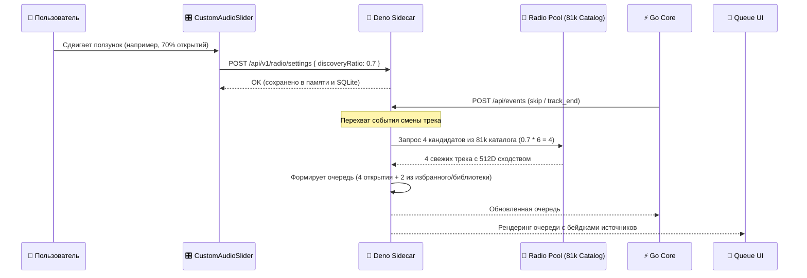

# 🏛️ Архитектура системы: Умное Нейро-Радио (musik + Sidecar + CLAP)

## 1. Топология сервисов и портов

```
┌─────────────────────────────────────────────────────────────────┐
│                           Клиенты                               │
│              (Web UI / Mobile / Автомобиль / VLC)               │
└────────────────────────────────▲────────────────────────────────┘
                                 │ HTTP :8787 (Стриминг, UI, API)
┌────────────────────────────────▼────────────────────────────────┐
│           🚀 Deno Sidecar Gateway (server.ts :8787)             │
│  - Zero-Intrusion Web Proxy & Overlay инжектор (/addon/ui.js)  │
│  - Регулятор баланса радио (discoveryRatio: 0% .. 100%)         │
│  - Двухуровневый пул рекомендаций (12D каталог -> 512D CLAP)    │
│  - Умный LRU Cache Manager (Лимит 3 ГБ, Orphan GC, Pin Protect) │
│  - Фоновый воркер импорта очереди (2000+ треков)                │
│  - Быстрая история прослушивания радио (<100мс)                 │
│  - On-Demand стриминг & yt-dlp загрузчик                        │
└───────────────▲───────────────────────────────▲─────────────────┘
                │ Прокси :8786                  │ HTTP IPC :8790
                │                               │ (CLAP расчет)
┌───────────────▼────────────────┐ ┌────────────▼─────────────────┐
│     ⚡ Go Core Player          │ │ 🧠 Python Embedder Daemon    │
│       (musik-player :8786)     │ │   (embedder.py --server :8790)
│  - Сессии, очередь, профили     │ │  - Веса CLAP прогреты в RAM │
│  - Базовые 12D рекомендации    │ │  - Инференс 1.5 - 3.0 сек    │
│  - Отдача Range-потоков        │ │  - Пакетная векторизация     │
└───────────────▲────────────────┘ └────────────▲─────────────────┘
                │ SQL                           │ SQL
                └───────────────┬───────────────┘
                                ▼
                 ┌──────────────────────────────┐
                 │    🗄️ SQLite (musik.db)      │
                 │  - tracks & features (512D)  │
                 │  - external_catalog (81k 12D)│
                 │  - listening_history         │
                 │  - pinned_tracks & favorites │
                 │  - ingestion_queue (2003 шт) │
                 └──────────────┬───────────────┘
                                │
                                ▼ Аудиофайлы
                 ┌──────────────────────────────┐
                 │       Хранилище аудио        │
                 │  dynamic/ (Кэш 3 ГБ, LRU)    │
                 │  favorites/ (Закрепленные 💾)│
                 └──────────────────────────────┘
```

---

## 2. Разделение обязанностей (Separation of Concerns)

| Компонент | Порт / Среда | Технологии | Обязанности |
| :--- | :--- | :--- | :--- |
| **Deno Sidecar** | `:8787` | Deno 2, TypeScript, SQLite | Единая точка входа. Проксирует запросы, регулирует баланс радио (`discoveryRatio`), инжектирует UI-расширения, управляет кэшем 3 ГБ, обслуживает воркер импорта и историю. |
| **Go Core** | `:8786` | Go, SQLite | Базовое ядро плеера `musik`. Ведет сессии прослушивания, историю воспроизведения, отдает сырой аудиопоток. Код **не модифицируется**. |
| **CLAP Daemon** | `:8790` | Python 3.11, PyTorch, Transformers, Librosa | Постоянно запущенный микросервис. Держит модель `larger_clap_music_and_speech` в RAM, оцифровывает треки в 512D векторы с минимальной задержкой. |
| **Web UI Overlay** | Браузер | Vanilla JS / CSS | Неинвазивный слой интерфейса. Добавляет ползунок баланса открытий, плашку источника текущего трека, бейджи в очереди, эксплорер импорта на 2000+ треков и вкладку «⏮ Прослушано». |

---

## 3. Регулирование баланса радио (Discovery Balance Engine)



* **При 0%:** Радио играет исключительно треки с отметкой «Любимое».
* **При 50%:** Радио ровно пополам чередует любимые треки и неизведанные песни из каталога 81k.
* **При 100%:** Радио превращается в чистую станцию открытий: ни одного повтора из библиотеки, только свежие треки, подходящие под ваш акустический вкус.

---

## 4. Движок отслеживания происхождения (Origin Tracking Engine)

Каждый трек в плеере снабжен цифровым паспортом происхождения:
1. `🧠 512D Вектор` — оцифрован нейросетью CLAP и имеет вектор размерности 512 в таблице `features`.
2. `⚡ 12D Каталог` — подобран по 12 числовым признакам (`energy`, `valence`, `tempo`, etc.) из таблицы `external_catalog` (81 000+ записей).
3. `❤️ Избранное` — присутствует в таблице `favorites`.
4. `💾 Закреплено` — присутствует в таблице `pinned_tracks` (не подлежит ротации).
5. `📁 <Плейлист>` — ассоциирован с пользовательским плейлистом в `playlist_tracks`.
6. `📥 Импорт` — поступил из пакетного файла через `ingestion_queue`.
7. `💿 Локальный` — физический файл хранится вне папки временного кэша `dynamic/`.

Отображение происходит в двух ключевых точках:
- **Главный экран плеера (Now Playing):** Контейнер `#addon-now-playing-origin` прямо под именем артиста.
- **Очередь будущих треков:** Цветные микро-бейджи напротив каждого элемента в списке `ol#queue`.

---

## 5. Защита диска: Избранное vs Закрепление

```
                ┌─────────────────────────────────┐
                │        Трек скачан в кэш        │
                └────────────────┬────────────────┘
                                 │
             Пользователь нажал лайк или сохранение?
                                 │
         ┌───────────────────────┴───────────────────────┐
         ▼                                               ▼
   Лайк «♥» (Избранное)                     Кнопка «💾» (Закрепить)
         │                                               │
Влияет на сессионный вкус.             Добавляется в таблицу pinned_tracks.
Может ротироваться из кэша             ИММУНИТЕТ к LRU-очистке.
при превышении лимита 3 ГБ,            Файл никогда не удаляется с диска.
если диск переполнен.
```

---

## 6. Конвейер фонового импорта (Ingestion Queue)

1. **Приём задачи:** Пользователь загружает `.txt` или `.m3u` файл (или вставляет текст).
2. **Парсинг:** Записи нормализуются к виду `{ artist, title }`. Очищаются повреждённые символы UTF-8.
3. **Пакетная вставка:** Все задачи разом сохраняются в SQLite таблицу `ingestion_queue` со статусом `pending`.
4. **Фоновый воркер (`ingestionWorker.step()`):**
   - Выбирает следующий `pending` трек.
   - Скачивает аудиопоток через `yt-dlp` с принудительной кодировкой `UTF-8`.
   - Регистрирует трек в Go Core.
   - Запрашивает 512D эмбеддинг у CLAP Daemon.
   - Переводит статус в `ready`.
5. **Интерактивный UI:** Вкладка «Загрузка» отображает таблицу всех 2000+ треков с фильтрами по статусам и живым поиском без перегрузки DOM.
