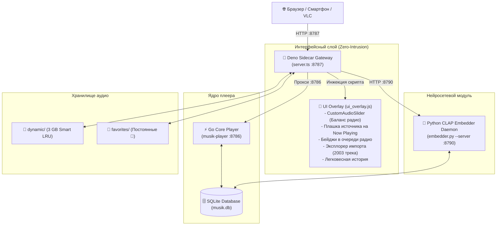

# 🎵 musik — Умное Self-Hosted Нейро-Радио & Музыкальный Сервер

Расширение для музыкального сервера [torwin-job/musik](https://github.com/torwin-job/musik) с поддержкой **on-demand стриминга**, **512D нейровекторных рекомендаций CLAP**, **12D каталога акустического блендинга на 81 000+ треков**, **ползунка баланса открытий**, **умного LRU-кэша 3 ГБ** и **истории прослушивания радио** без изменения оригинального исходного кода Go-ядра (**Zero-Intrusion Architecture**).

---

## 🧭 Философия проекта: Умное Радио вместо обычного плеера

Этот проект превращает локальный плеер в автономную адаптивную радиостанцию:
1. **Не застревать в одной и той же музыке:** Плеер не крутит по кругу одни и те же скачанные песни. Он исследует пространство музыкальных тембров и настроений.
2. **Мгновенный отклик при быстром переключении:** Если вы быстро листаете треки, плеер не зависает в ожидании скачивания или тяжелой нейросети — он моментально берет подходящий трек из 12D каталога (81k треков), а затем плавно дообучает 512D семантический профиль.
3. **Полный контроль над балансом:** Вы сами решаете, сколько в эфире должно быть знакомых любимых треков, а сколько — свежих открытий из внешнего каталога.
4. **Защита хранилища:** Кэш строго держится в пределах заданного лимита (3 ГБ). Лайк формирует вкус, но не забивает диск навечно. Если трек дорог — он сохраняется навсегда специальной кнопкой `💾`.
5. **Zero Technical Debt:** Никаких правок в репозитории Go Core. Всё расширение выполнено как изолированный модульный Sidecar Gateway на чистом Deno + SQLite, готовый к публикации на GitHub.

---

## ✨ Ключевые возможности

### 1. 🎛️ Ползунок «Баланс открытий» и Класс `CustomAudioSlider`
* **Плавная регулировка радиопотока:**
  - `0%` — ❤️ Только любимое (воспроизводятся только треки с сердечком).
  - `50%` — ⚖️ Баланс 50 / 50 (половина эфира — любимое, половина — свежие открытия).
  - `100%` — 🚀 Только новые треки (поток формируется исключительно из внешнего 81k каталога по вашим предпочтениям).
* **Модульная архитектура компонентов (`CustomAudioSlider`):**
  - Экспортирован в `window.CustomAudioSlider`.
  - Легковесный vanilla JS класс с инкапсулированной версткой, `localStorage`-персистентностью, живыми бейджами и коллбэками. Позволяет добавлять любые будущие регуляторы параметров в одну строчку.

### 2. 🏷️ Прозрачные бейджи источников треков
Теперь на **главном экране плеера (Now Playing)** прямо под именем артиста и в **очереди будущих треков радио** всегда видно, откуда взялась каждая композиция:
* `🧠 512D Вектор` — оцифрован нейросетью CLAP и подобран по нейросемантическому сходству.
* `⚡ 12D Каталог` — взят из внешнего каталога 81k+ треков по акустическим характеристикам.
* `❤️ Избранное` — трек из ваших сохранённых лайков.
* `💾 Закреплено` — трек сохранён навсегда на диск и защищён от автоочистки кэша.
* `📁 <Имя плейлиста>` — трек принадлежит пользовательскому плейлисту.
* `📥 Импорт` — поступил из пакетного файла плейлиста.
* `💿 Локальный` — аудиофайл из локальной коллекции.

### 3. ⚡ Двухуровневая рекомендательная система (12D + 512D)
* **Быстрое переключение (12D):** Подбор по 12 параметрам (`energy`, `valence`, `tempo`, `danceability`, `acousticness` и др.) из 81 000+ треков.
* **Глубокий акустический вкус (512D CLAP):** Полноценное семантическое понимание тембра и настроения на базе модели `laion/larger_clap_music_and_speech`.

### 4. 🧠 Постоянный демон эмбеддингов (Embedder Daemon)
* Нейросеть CLAP постоянно прогрета в памяти (демон на `127.0.0.1:8790`).
* Время оцифровки трека сокращено с **15–20 секунд до 1.5–3 секунд**.
* Фоновый воркер автоматически векторизует треки библиотеки во время простоя.

### 5. 💾 Умный LRU-кэш 3 ГБ с защитой закреплений
* **Автоматическая ротация:** Кэш строго удерживается в пределах лимита (по умолчанию 3 ГБ), удаляя наименее востребованные файлы.
* **Разделение Любимое (`♥`) vs Закрепленное (`💾`):**
  - `♥` **Избранное:** Влияет на рекомендации и сессионный профиль, но ротируется при переполнении кэша.
  - `💾` **Закреплено навсегда:** Полный иммунитет к удалению.
* **Orphan GC:** Автоматическая зачистка файлов-сирот, на которые нет ссылок в базе данных.

### 6. 📜 Неограниченная и сверхлегковесная история прослушивания
* Доступна во вкладке **⏮ Прослушано** в правой панели плеера.
* **DOM Batching:** В DOM рендерится порциями по 50 элементов — не лагает даже на тысячах прослушанных треков.
* **Живой поиск:** Мгновенная фильтрация по названию, артисту, источнику или тегам.
* **Быстрый запуск:** Клик по треку мгновенно запускает повторное воспроизведение.
* **Оптимизированные запросы:** Предикаты `EXISTS` по первичным ключам SQLite обеспечивают время ответа **< 100 мс**.

### 7. 📂 Интерактивный эксплорер импорта (2000+ треков)
* Во вкладке «Загрузка» доступен полноценный менеджер пакетного импорта:
  - Кнопка `📁 Загрузить файл со списком (.txt, .m3u)` со стандартным файловым диалогом.
  - Интерактивная таблица всех импортированных треков со статусами (`✓ Готовы`, `⟳ В процессе`, `⏳ В очереди`, `✕ Ошибки`) и живым поиском.
  - Кнопка `💔 Снять отметку ❤️ с импортированных треков` в 1 клик восстанавливает баланс радио, снимая отметку «Избранное» с загруженного списка.

### 8. 🛡️ Music & Speech Guard: Защита от подкастов и аудиокниг
* **Строгий контроль длительности:** Радио воспроизводит только полноценные музыкальные композиции (от 40 секунд до 12 минут). Короткие звуковые мемы, 1-часовые подкасты и многочасовые аудиокниги автоматически отсекаются.
* **Акустический речевой фильтр (`speechiness`):** Внешний каталог 81k отфильтрован по порогу речи (`speechiness <= 0.35`), предотвращая попадание разговорного аудио.
* **Каскадный фильтр поисковой выдачи:** Поисковые запросы автоматически снабжаются музыкальными директивами и флагом `--match-filter "duration <= 720 & duration >= 40"`, а результаты с ключевыми словами подкастов, интервью и аудиокниг мгновенно бракуются.

### 9. 🛡️ Zero-Intrusion Архитектура
* Никаких модификаций оригинального репозитория `musik-main/`.
* Deno Sidecar Gateway прозрачно проксирует трафик, защищает от зацикливаний радио и инжектирует веб-интерфейс на лету.

---

## 🏗 Архитектура системы



---

## 🚀 Быстрый старт

### Требования
* **Deno:** 1.40+ (встроен в `bin/` или системный)
* **Python:** 3.10+ с `torch`, `torchaudio`, `transformers`, `librosa`
* **Go:** 1.22+ (для сборки Go Core)
* **FFmpeg** и **yt-dlp**

### Запуск одной командой (Windows)
```powershell
.\scripts\start_all.ps1
```
Сервер поднимет все 3 службы и откроет плеер по адресу:
👉 **http://127.0.0.1:8787/**

### Запуск (Linux / macOS)
```bash
chmod +x scripts/*.sh
./scripts/start_all.sh
```

---

## 📡 REST API расширения

| Метод | Эндпоинт | Описание |
| :--- | :--- | :--- |
| `GET` | `/api/v1/radio/settings` | Получить настройки радио (`discoveryRatio`) |
| `POST` | `/api/v1/radio/settings` | Обновить баланс радио (`{ discoveryRatio: 0.0 .. 1.0 }`) |
| `GET` | `/api/v1/radio/history` | Неограниченная оптимизированная история прослушивания |
| `GET` | `/api/v1/tracks/:id/origin` | Получить происхождение одного трека (512D, 12D, плейлист, избранное) |
| `POST` | `/api/v1/tracks/origins` | Пакетный запрос происхождения треков (по ID и по названию) |
| `GET` | `/api/v1/cache` | Статистика кэша: занятый объём, лимит, количество 512D векторов |
| `POST` | `/api/v1/cache/clean` | Ручной запуск очистки временного кэша |
| `POST` | `/api/v1/tracks/:id/pin` | Закрепить трек навсегда на диске (иммунитет к LRU-очистке) |
| `DELETE` | `/api/v1/tracks/:id/pin` | Открепить трек от диска |
| `POST` | `/api/v1/import/playlist` | Запустить фоновый импорт текстового плейлиста |
| `GET` | `/api/v1/import/status` | Сводный статус воркера очереди импорта |
| `GET` | `/api/v1/import/items` | Список треков очереди импорта с пагинацией, фильтрацией и поиском |
| `POST` | `/api/v1/import/unfavorite` | Снять отметку «Избранное» со всех импортированных треков |
| `POST` | `/api/v1/catalog/blend` | Поиск 12D кандидатов в каталоге 81k по акустическим свойствам |

---

## 🧪 Тестирование

Набор автоматических тестов проверяет работу 12D каталога, очереди импорта, LRU-кэша и пула радио:
```bash
deno test --allow-all extensions/fetcher/tests
```

Все тесты изолированы и используют in-memory SQLite:
```
running 2 tests from ./extensions/fetcher/tests/dataset_bridge_test.ts ... ok
running 1 test from ./extensions/fetcher/tests/ingestion_queue_test.ts ... ok
running 1 test from ./extensions/fetcher/tests/lru_test.ts ... ok
running 1 test from ./extensions/fetcher/tests/radio_pool_test.ts ... ok

ok | 5 passed | 0 failed
```

---

## 📄 Лицензия

Проект распространяется под лицензией MIT. Оригинальное ядро `musik` создано [torwin-job](https://github.com/torwin-job/musik).
